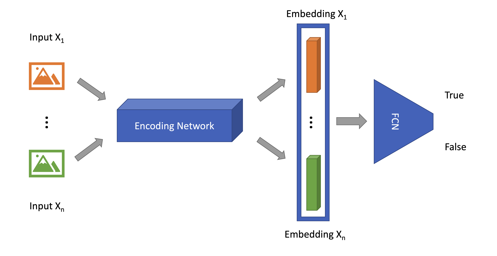
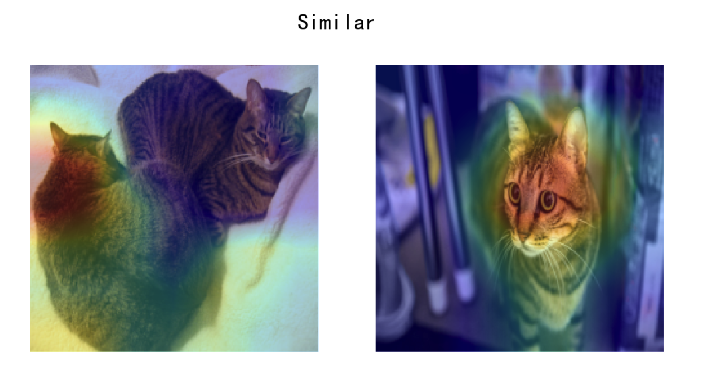

# Twin Neural Network Training with PyTorch and fast.ai and its Deployment with TorchServe on Amazon SageMaker

<!-- @import "[TOC]" {cmd="toc" depthFrom=1 depthTo=6 orderedList=false} -->

<!-- code_chunk_output -->

- [Twin Neural Network Training with PyTorch and fast.ai and its Deployment with TorchServe on Amazon SageMaker](#twin-neural-network-training-with-pytorch-and-fastai-and-its-deployment-with-torchserve-on-amazon-sagemaker)
  - [Introduction](#introduction)
  - [Getting started with a PyTorch model trained with fast.ai](#getting-started-with-a-pytorch-model-trained-with-fastai)
    - [Model Architecture](#model-architecture)
      - [Encoding Network](#encoding-network)
      - [Fully Connected Network](#fully-connected-network)
      - [Twin Network](#twin-network)
    - [Dataset and Transformations](#dataset-and-transformations)
    - [Images Pair and Labels](#images-pair-and-labels)
    - [Split and Dataloader](#split-and-dataloader)
    - [Training and Saving](#training-and-saving)
    - [Convolutional Neural Network Interpretation](#convolutional-neural-network-interpretation)
  - [Deployment to TorchServe](#deployment-to-torchserve)
    - [Custom Handler](#custom-handler)
      - [`initialize`](#initialize)
      - [`preprocess`](#preprocess)
      - [`inference`](#inference)
      - [`postprocess`](#postprocess)
    - [TorchServe in Action](#torchserve-in-action)
  - [Deployment to Amazon SageMaker Inference Endpoint](#deployment-to-amazon-sagemaker-inference-endpoint)
    - [Real-time Inference with Python SDK](#real-time-inference-with-python-sdk)
    - [Web Application Demonstration](#web-application-demonstration)
    - [Clean up](#clean-up)
  - [Conclusion](#conclusion)
  - [Reference](#reference)

<!-- /code_chunk_output -->

## Introduction

Twin Neural Network (commonly known as a Siamese Neural Network) makes predictions leveraging information from multiple sources. A common use case is taking multiple input data, e.g. images, and predicting whether they belong to the same class; though its application does not necessarily limit to computer vision or classification problems. In practise, however, artificial neural network training takes extensive and sophisticated efforts. Fortunately, there are a variety of deep learning frameworks available to tackle those, and out which stands out [fast.ai](https://www.fast.ai/) that has become one of the most cutting-edge, open source, deep learning frameworks based on [PyTorch](https://pytorch.org/). It provides concise user interface and well designed, documented APIs, which empowers developers and machine learning practitioners with productivity and flexibility.

For deployment, [Amazon Web Services (Amazon AWS)](https://aws.amazon.com/) developed [TorchServe](https://pytorch.org/serve/) in partnership with Meta (previously, Facebook), which is a flexible and easy-to-use open source tool for serving PyTorch models. It removes the heavy lifting of deploying and serving PyTorch models with Kubernetes. With TorchServe, many features are out-of-the-box and they provide full flexibility of deploying trained PyTorch models at scale. In addition, [Amazon SageMaker](https://aws.amazon.com/sagemaker/) endpoint has been a fully managed service that allows users to make real-time inferences via a REST API, and save developers from managing their own server instances, load balancing, fault-tolerance, auto-scaling and model monitoring, etc. Amazon SageMaker endpoint supports industry level machine learning inference and graphics-intensive applications while being [cost-effective](https://aws.amazon.com/sagemaker/pricing/).

In this repository we demonstrate how to train a Twin Neural Network based on PyTorch and fast.ai, and deploy it with TorchServe on Amazon SageMaker Inference endpoint. For demonstration purpose, we build an interactive web application for users to upload images and make inference from the trained and deployed model, based on [streamlit](https://streamlit.io/), which is an open source framework for data scientists to efficiently create interactive web-based data applications in pure Python.

All the code used in this document is available on [GitHub](https://github.com/aws-samples/amazon-sagemaker-endpoint-deployment-of-siamese-network-with-torchserve).

## Getting started with a PyTorch model trained with fast.ai

In this section, we train a fast.ai model that determine whether two pet images are of the same breed or not.

The first step is to install fast.ai package, which is covered in its [Github](https://github.com/fastai/fastai) repository.

> If you're using Anaconda then run:
> ```python
> conda install -c fastai -c pytorch -c anaconda fastai gh anaconda
> ```
> ...or if you're using miniconda) then run:
> ```python
> conda install -c fastai -c pytorch fastai
> ```

For other installation options, please refer to the fast.ai documentation. The following materials are based on the documentation: "[Tutorial - Using fastai on a custom new task](https://docs.fast.ai/tutorial.siamese.html#Patch-in-a-siampredict-method-to-Learner,-to-automatically-show-images-and-prediction)", with customisations specified below.

### Model Architecture

For Twin Neural Networks, multiple input data are passed through a _encoding_ neural network to generated their hyper-dimensional embedding vectors, which are concatenated before fed into a _fully connected network_ for output, as shown in _Fig. 1_.

|  |
|:--:|
| **Fig. 1 - Twin Neural Network Architecture**|

#### Encoding Network

`ResNet50` is used, as an example, with its pre-trained weights, and the last fully connected layer is removed.

```python
import torchvision.models as models
from torch.nn import (
    Sequential,
)

encoder = Sequential(
            *list(
              models.resnet50(pretrained=True).children()
            )[:-2]
          )
```

#### Fully Connected Network

Consisting of concatenated average and max pooling (according to fast.ai), tensor flattening, batch normalisation, dropout, linear layers and activation functions. The output is a single vector of size `2` indicating if the input images are different or same.

```python
from torch.nn import (
    AdaptiveAvgPool2d,
    AdaptiveMaxPool2d,
    Flatten,
    BatchNorm1d,
    Dropout,
    Linear,
    ReLU,
    Module,
    Sequential,
)

class AdaptiveConcatPool2d(Module):
    "FastAI: Layer that concats `AdaptiveAvgPool2d` and `AdaptiveMaxPool2d`"

    def __init__(self, size=None):
        super().__init__()
        self.size = size or 1
        self.ap = AdaptiveAvgPool2d(self.size)
        self.mp = AdaptiveMaxPool2d(self.size)

    def forward(self, x):
        return torch.cat([self.mp(x), self.ap(x)], 1)

head = Sequential(
            AdaptiveConcatPool2d(1),
            Flatten(),
            BatchNorm1d(8192),
            Dropout(0.05),
            Linear(8192, 512, False),
            ReLU(True),
            BatchNorm1d(512),
            Dropout(0.1),
            Linear(512, 2, False),
        )
```

#### Twin Network

As shown in _Fig. 1_, both images are passed through the encoding network, and the output is concatenated before fed into the fully connected network.

```python
class SiameseModel(Module):
    def __init__(self, encoder, head):
        super().__init__()
        self.encoder, self.head = encoder, head

    def forward(self, x1, x2):
        ftrs = torch.cat([self.encoder(x1), self.encoder(x2)], dim=1)
        return self.head(ftrs)

model = SiameseModel(encoder, head)
```

### Dataset and Transformations

Import `fastai.vision` modules and download the sample data `PETS`, by:

```python
from fastai.vision.all import *
path = untar_data(URLs.PETS)
files = get_image_files(path/"images")
```

Next, define the image transformations in PyTorch, including resizing, converting to `FloatTensor` data type, re-order dimension, and image normalisation with statistics from [ImageNet](http://www.image-net.org/) for transfer learning:

```python
from torchvision import transforms

image_tfm = transforms.Compose(
            [
                transforms.Resize((224, 224)),
                transforms.ToTensor(),
                transforms.Normalize(
                    mean=[0.485, 0.456, 0.406], std=[0.229, 0.224, 0.225]
                ),
            ]
        )
```

### Images Pair and Labels

Per fast.ai's unique semantic requirement, define the basic image-pair and label data entity for visualisation, by:

```python
class SiameseImage(fastuple):
    @staticmethod
    def img_restore(image: torch.Tensor):
        return (image - image.min()) / (image.max() - image.min())

    def show(self, ctx=None, **kwargs):
        if len(self) > 2:
            img1, img2, same_breed = self
        else:
            img1, img2 = self
            same_breed = "Undetermined"
        if not isinstance(img1, Tensor):
            t1, t2 = image_tfm(img1), image_tfm(img2)
        else:
            t1, t2 = img1, img2
        line = t1.new_zeros(t1.shape[0], t1.shape[1], 10)
        return show_image(
            torch.cat([self.img_restore(t1), line, self.img_restore(t2)], dim=2),
            title=same_breed,
            ctx=ctx,
        )
```

Then define the helper function parsing image breads from its file path, and takes all the images from the dataset, randomly draw pairs of them, determined by if they are the same breed or not in random, by:

```python
def label_func(fname):
    return re.match(r'^(.*)_\d+.jpg$', fname.name).groups()[0]

class SiameseTransform(Transform):
    def __init__(self, files, label_func, splits):
        self.labels = files.map(label_func).unique()
        self.lbl2files = {
            l: L(f for f in files if label_func(f) == l) for l in self.labels
        }
        self.label_func = label_func
        self.valid = {f: self._draw(f) for f in files[splits[1]]}

    def encodes(self, f):
        f2, t = self.valid.get(f, self._draw(f))
        img1, img2 = PILImage.create(f), PILImage.create(f2)
        if (f not in self.valid) and random.random() < 0.5:
            img1, img2 = img2, img1
        img1, img2 = image_tfm(img1), image_tfm(img2)
        return SiameseImage(img1, img2, t)

    def _draw(self, f):
        same = random.random() < 0.5
        cls = self.label_func(f)
        if not same:
            cls = random.choice(L(l for l in self.labels if l != cls))
        return random.choice(self.lbl2files[cls]), same
```

Note the raw image transformation pipeline defined above is applied, together with an extra data augmentation during training: randomly swap the two images from the pair without changing of the label.

### Split and Dataloader

Randomly split the dataset into train/validation partitions, and construct `dataloaders` for each them with specified batch size, by:

```python
splits = RandomSplitter()(files)
tfm = SiameseTransform(files, label_func, splits)
tls = TfmdLists(files, tfm, splits=splits)
dls = tls.dataloaders(
    bs=32,
    after_batch=[*aug_transforms()],
)
```

### Training and Saving

Now setup loss function and parameter groups, after which trigger the fast.ai training process.

```python
def loss_func(out, targ):
    return nn.CrossEntropyLoss()(out, targ.long())

def siamese_splitter(model):
    return [params(model.encoder), params(model.head)]

learn = Learner(
    dls, model, loss_func=loss_func, splitter=siamese_splitter, metrics=accuracy
)

learn.freeze()
learn.fit_one_cycle(4, 1e-3)
>>> 
epoch   train_loss	valid_loss	accuracy	time
0	0.258882	0.202665	0.924222	00:38
1	0.220346	0.176225	0.936401	00:38
2	0.189951	0.118699	0.955345	00:37
3	0.155383	0.106692	0.960758	00:37

learn.unfreeze()
learn.fit_one_cycle(4, slice(1e-6,1e-4))
>>> 
epoch	train_loss	valid_loss	accuracy	time
0	0.150795	0.102173	0.965494	00:47
1	0.143765	0.095281	0.965494	00:47
2	0.127819	0.106920	0.958728	00:47
3	0.132385	0.093117	0.964141	00:47
```

Finally, we export the PyTorch model weights to use for following sections.

```python
torch.save(learn.encoder.state_dict(), "./model/encoder_weight.pth")
torch.save(learn.head.state_dict(), "./model/head_weight.pth")
```

For more details about the modeling process, refer to `notebook/01_fastai_siamese.ipynb` [[link](notebook/01_fastai_siamese.ipynb)].

### Convolutional Neural Network Interpretation

The activations out of each convolutional layer can be interpreted as an extracted feature map of the input image, and the number of activations are determined by the number of convolutional filters specified in that layer. When all these activations are summed up with weights corresponding to a certain prediction, we get the _class activation map_ (CAM) which can be used as a heatmap illustrating the importance of different areas of the input image, or how much attention the model paid on different zones of the image, to make that prediction. These can be achieved by using PyTorch hook:

```python
class HookCAM:
    def __init__(self, module):
        self.hook = module.register_forward_hook(self.hook_func)
        self.stored = []

    def hook_func(self, module, inputs, outputs):
        self.stored.append(outputs.detach().clone())

    def __enter__(self, *args):
        return self

    def __exit__(self, *args):
        self.hook.remove()


class HookCAMBwd:
    def __init__(self, module):
        self.hook = module.register_full_backward_hook(self.hook_func)
        self.stored = []

    def hook_func(self, module, grad_inputs, grad_outputs):
        self.stored.append(grad_outputs[0].detach().clone())

    def __enter__(self, *args):
        return self

    def __exit__(self, *args):
        self.hook.remove()
```

With weights being the average of gradients on each convolutional filter, multiplied by the corresponding activations before summing up, we get the CAM for the prediction, as illutrated in _Fig. 2_:

```python
from PIL import Image

imgtest, imgval = (
    Image.open("./sample/c1.jpg").convert("RGB"),
    Image.open("./sample/c2.jpg").convert("RGB"),
)
imgtest_ts = image_tfm(imgtest)[None, ...]
imgval_ts = image_tfm(imgval)[None, ...]

with HookCAMBwd(encoder) as hookg:
    with HookCAM(encoder) as hook:

        l_emb = encoder(imgtest_ts)
        r_emb = encoder(imgval_ts)

        ftrs = torch.cat([l_emb, r_emb], dim=1)
        res = head(ftrs)[0]
        act = hook.stored

    pred_cls = res.argmax().item()
    res[pred_cls].backward()
    grad = hookg.stored
    
weight_left = grad[0][0].mean(dim=[1, 2], keepdim=True)
cam_map_left = (weight_left * act[0][0]).sum(0)

weight_right = grad[1][0].mean(dim=[1, 2], keepdim=True)
cam_map_right = (weight_right * act[1][0]).sum(0)
```

> "cats" by nate steiner is marked with CC0 1.0. To view the terms, visit https://creativecommons.org/publicdomain/zero/1.0/?ref=openverse.
> "cat" by doublefire1 is marked with CC0 1.0. To view the terms, visit https://creativecommons.org/publicdomain/zero/1.0/?ref=openverse.
> "Roommate's cat Steve 1" by D Coetzee is marked with CC0 1.0. To view the terms, visit https://creativecommons.org/publicdomain/zero/1.0/?ref=openverse.
> "Roommate's cat Steve 4" by D Coetzee is marked with CC0 1.0. To view the terms, visit https://creativecommons.org/publicdomain/zero/1.0/?ref=openverse.

|  |
|:--:|
| **Fig. 2 - Class Activation Map**|

For more details please refer to `notebook/02_pytorch_inference.ipynb` [[link](notebook/02_pytorch_inference.ipynb)].

## Deployment to TorchServe

TorchServe is easy to use. It comes with a convenient commnad line interface (CLI) to deploy locally. Though it comes with default handlers for common problems such as image classification, object detection, image segmentation, and text classification, we can always tailor it for our own specifications: as TorchServe is open source, which means it’s fully open and extensible to fit any deployment needs.

In this section we deploy the PyTorch model to TorchServe. For installation, please refer to TorchServe [Github](https://github.com/pytorch/serve) Repository. Overall, there are mainly 3 steps to use TorchServe:

1. Archive the model into `*.mar`.
2. Start the `torchserve`.
3. Call the API and get the response.

In order to archive the model, 3 files are needed in our case:

1. PyTorch encoding model `ResNet50` weights `encoder_weight.pth`.
2. PyTorch fully connected network weights `head_weight.pth`
3. TorchServe custom handler.

### Custom Handler

As shown in `/deployment/handler.py`, the TorchServe handler accept `data` and `context`. In our example, we define another helper Python class with 4 instance methods to implement: `initialize`, `preprocess`, `inference` and `postprocess`.

#### `initialize`

Workout if GPU is available, then identify the serialized model weights file path and finally instantiate the PyTorch model and put it to evaluation mode.

```python
    def initialize(self, ctx):
        """
        load eager mode state_dict based model
        """
        properties = ctx.system_properties
        self.device = torch.device(
            "cuda:" + str(properties.get("gpu_id"))
            if torch.cuda.is_available()
            else "cpu"
        )

        logger.info(f"Device on initialization is: {self.device}")
        model_dir = properties.get("model_dir")

        manifest = ctx.manifest
        serialized_file = manifest["model"]["serializedFile"]
        model_pt_path = os.path.join(model_dir, serialized_file)
        if not os.path.isfile(model_pt_path):
            raise RuntimeError("Missing the model definition file")

        encoder_reload_weights = torch.load(
            os.path.join(model_dir, "encoder_weight.pth"), map_location=self.device
        )
        self.encoder_reload.load_state_dict(encoder_reload_weights)
        self.encoder_reload.to(self.device)
        self.encoder_reload.eval()

        head_reload_weights = torch.load(
            os.path.join(model_dir, "head_weight.pth"), map_location=self.device
        )
        self.head_reload.load_state_dict(head_reload_weights)
        self.head_reload.to(self.device)
        self.head_reload.eval()

        self.initialized = True
```

#### `preprocess`

Here read the image and apply the transformation pipeline to the inference data.

```python
    def preprocess(self, data):
        """
        Scales and normalizes a PIL image for an U-net model
        """
        self.cam_map_left, self.cam_map_right = None, None
        left_image = data[0]["left"]
        right_image = data[0]["right"]
        self.cam = eval(data[0]["cam"])

        left_image = Image.open(io.BytesIO(left_image)).convert("RGB")
        right_image = Image.open(io.BytesIO(right_image)).convert("RGB")

        left_image = self.image_tfm(left_image)[None, ...]  # batch size of 1
        right_image = self.image_tfm(right_image)[None, ...]  # batch size of 1

        return left_image, right_image
```

#### `inference`

Now load the data into GPU if available, and pass it through the model consisting of both encoder and fully connected network. If CAM is required, calculate and return the heatmap.

```python
    def inference(self, left_image, right_image):
        """
        Predict the chip stack mask of an image using a trained deep learning model.
        """
        if not self.cam:
            logger.info("no cam")
            with torch.no_grad():
                left_image, right_image = left_image.to(self.device), right_image.to(
                    self.device
                )
                left_embedding = self.encoder_reload(left_image)
                right_embedding = self.encoder_reload(right_image)
                res = self.head_reload(
                    torch.cat([left_embedding, right_embedding], dim=1)
                )[0]

        else:
            logger.info("cam")
            with HookCAMBwd(self.encoder_reload) as hookg:
                with HookCAM(self.encoder_reload) as hook:
                    left_image, right_image = left_image.to(
                        self.device
                    ), right_image.to(self.device)
                    left_embedding = self.encoder_reload(left_image)
                    right_embedding = self.encoder_reload(right_image)

                    res = self.head_reload(
                        torch.cat([left_embedding, right_embedding], dim=1)
                    )[0]
                    act = hook.stored

                pred_cls = res.argmax().item()
                res[pred_cls].backward()
                grad = hookg.stored
            
            self.encoder_reload.zero_grad(), self.head_reload.zero_grad()

            weight_left = grad[0][0].mean(dim=[1, 2], keepdim=True)
            self.cam_map_left = (weight_left * act[0][0]).sum(0)

            weight_right = grad[1][0].mean(dim=[1, 2], keepdim=True)
            self.cam_map_right = (weight_right * act[1][0]).sum(0)

        return res
```

#### `postprocess`

The inference raw output is unloaded from GPU if available, combined with CAM to be returned back to the API trigger.

```python
    def postprocess(self, inference_output):
        logger.info("start postprocessing")
        if torch.cuda.is_available():
            inference_output = inference_output.cpu()
            if self.cam:
                self.cam_map_left = self.cam_map_left.cpu()
                self.cam_map_right = self.cam_map_right.cpu()
        else:
            inference_output = inference_output

        if not self.cam:
            return [inference_output.numpy().tolist()]
        else:
            return [
                inference_output.detach().numpy().tolist()
                + self.cam_map_left.detach().numpy().tolist()
                + self.cam_map_right.detach().numpy().tolist()
            ]
```

Now it's ready to setup and launch TorchServe.

### TorchServe in Action

Step 1: Archive the model PyTorch

```bash
torch-model-archiver --model-name siamese --version 1.0 --serialized-file ./model/encoder_weight.pth --export-path model_store --handler ./deployment/handler.py -f --extra-files ./model/head_weight.pth -f
```

Step 2: Serve the Model

```bash
torchserve --start --ncs --model-store model_store --models siamese.mar
```

Step 3: Call API and Get the Response (here we use [httpie](https://httpie.org/)).

```bash
time http --form POST http://127.0.0.1:8080/predictions/siamese left@sample/c1.jpg right@sample/c2.jpg cam=False
>>>
HTTP/1.1 200
Cache-Control: no-cache; no-store, must-revalidate, private
Expires: Thu, 01 Jan 1970 00:00:00 UTC
Pragma: no-cache
connection: keep-alive
content-length: 46
x-request-id: e51e2f15-a9b6-4522-b700-c0f5e35008a7

\[
  -0.938737690448761,
  0.7865392565727234
\]


real    0m1.765s
user    0m0.334s
sys     0m0.036s
```

The first call would have longer latency due to model weights loading defined in `initialize`, but this will be mitigated from the second call onward. For more details about `TorchServe` setup and usage, please refer to `notebook/02_pytorch_inference.ipynb` [[link](notebook/02_pytorch_inference.ipynb)].

## Deployment to Amazon SageMaker Inference Endpoint

For customised machine learning model deployment and hosting, Amazon SageMaker is fully modular, which means we can always bring in customised algorithms and containers and use only the services that are required. In our case it is the Amazon SageMaker Model and Endpoint. Concretely, we are building a TorchServe container and host it using Amazon SageMaker for a fully-managed model hosting and elastic scaling experience, with simply a few lines of code. On the client side, we get predictions with simple API calls to its secure endpoint backed by TorchServe.

There are 4 steps to setup a SageMaker Endpoint with TorchServe:

1. Build customized Docker Image and push to Amazon Elastic Container Registry (ECR). The dockerfile is provided in root of this code repository, which helps setup CUDA and TorchServe dependencies.
2. Compress `*.mar` into `*.tar.gz` and upload to Amazon Simple Storage Service (S3).
3. Create SageMaker model using the docker image from step 1 and the compressed model weights from step 2.
4. Create the SageMaker endpoint using the model from step 3.

The details of these steps are described in `notebook/03_SageMaker.ipynb` [[link](notebook/03_SageMaker.ipynb)]. Once ready, we can invoke the SageMaker endpoint with images in real-time.

### Real-time Inference with Python SDK

Read sample images.

```python
cam = False
r = requests.Request(
    "POST",
    "http://localhost:8080/invocations",
    files={
        "left": open("./sample/c1.jpg", "rb"),
        "right": open("./sample/c2.jpg", "rb"),
    },
    data={"cam": str(cam)}
)
r = r.prepare()
content_type = r.headers["Content-Type"]
payload = r.body
content_type, type(payload)
```

Invoke the SageMaker endpoint with the image and obtain the response from the API.

```python
client = boto3.client("sagemaker-runtime")
response = client.invoke_endpoint(
        EndpointName=endpoint_name, ContentType=content_type, Body=payload
    )
res = response["Body"].read()
neg, pos, *maps = eval(res)
neg, pos
>>> (-0.9403411149978638, 0.7890562415122986)
```

### Web Application Demonstration

Streamlit is an open source framework for data scientists to efficiently create interactive web-based data applications in pure Python. It allows for quick end-to-end deployment with minimal effort and the ability to scale out the application as needed in a secure and robust way, without getting bogged down in time-consuming front-end development.

To run the streamlit application provided in the root of this code repository, first install the dependencies by:

```sh
pip install -r requirements-demo.txt
```

And setup the AWS credentials according to [Set up AWS Credentials and Region for Development documentation](https://docs.aws.amazon.com/sdk-for-java/v1/developer-guide/setup-credentials.html). After updating `SAGEMAKER_ENDPOINTS` and `REGIONS` in the `./app.py` according to your setup, run:

```sh
streamlit run app.py 
```

This will enable users to upload images, invoke the SageMaker endpoint, and visualise the inference results with model explainability.


### Clean up

Make sure that you delete the following resources to prevent any additional charges:

1. Amazon SageMaker endpoint.
2. Amazon SageMaker endpoint configuration.
3. Amazon SageMaker model.
4. Amazon Elastic Container Registry (ECR).
5. Amazon Simple Storage Service (S3) Buckets.

## Conclusion

This repository presented an end-to-end workflow of training a Twin Neural Network with PyTorch and fast.ai, followed by its deployment with TorchServe eager mode on Amazon SageMaker Endpoint. You can use this repository as a template to develop and deploy your own deep learning solutions. This approach eliminates the self-maintaining effort to build and manage a customised inference server, which helps to speed up the process from training a cutting-edge deep learning model to its online application in real-world at scale.

## Reference

- [fast.ai · Making neural nets uncool again](https://www.fast.ai/)
- [Tutorial - Using fastai on a custom new task](https://docs.fast.ai/tutorial.siamese.html#Patch-in-a-siampredict-method-to-Learner,-to-automatically-show-images-and-prediction)
- [Deep Learning for Coders with Fastai and Pytorch: AI Applications Without a PhD](https://www.amazon.com/Deep-Learning-Coders-fastai-PyTorch/dp/1492045527)
- [Walk with fastai: Lesson 7 - Siamese](https://walkwithfastai.com/Siamese)
- [TORCHSERVE](https://pytorch.org/serve/)
